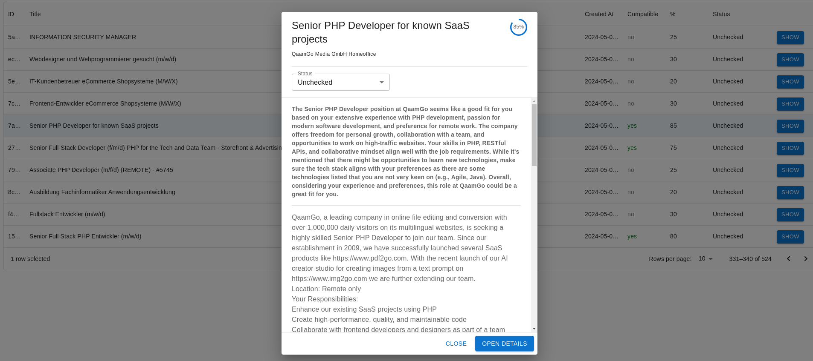

# Job Scanner

This project will scrape jobs from Indeed, store the jobs into a MongoDB database and analyze the jobs with AI. You can run it every day and create a personal database of relevant jobs. AI will also check if the job is good for you so you don't have to waste your time.



## Motivation

I made this to help me find a good job which fits my requirments, without the need to go through each job description one by one. The Open AI Assistant will check the job description for me and decide if the hob is good for me. The bot will output a json object which I can add to the database.
This project also has a (NextJS) frontend. It will show all the scraped jobs in a (MUI) table. In the end I will have to go only through a smaller list of jobs and check these manually.
This small project is saving me time and you can use it if you want.

I made it work with the German Indeed site. Maybe it is already working with other countries. This project is probably short lived because every website is changing all the time, that means that the scraper will stop working and you will have to fix it (eg. update the css selectors)

## Requirments

- node 20
- MongoDB (this project contains a docker-compose.yaml file so you can start a MongoDB instance locally). You can also create a free MongoDB instance directly from the MongoDB website.
- Open AI api key (I use the gpt-3.5fast model, but gpt-4 model is better faster, costs a little bit more)

## How to make it run?

- copy `.env.example` to `.env.local`. Edit `.env.local` to set the MongoDB settings and openai assistant. Make also sure t hat you set `OPENAI_API_KEY` environment variable globally with a working API key.
- edit `scraper-options.json`. This file will contain all the search keywords for your job you are interested in. It can have the keyword and also the amount of pages to scrape. For the first run, you could scrape many pages and for the consecutive runs you can scrape only 1 or 2 pages per day.
- Start the web server with docker or dev server:
    - docker: the container: `docker-compose up -d`
    - dev server: yarn dev
- Now you can open the project by navigation to `http://localhost:3000/`. But this does not contain any jobs yet. So you will have to scrape the jobs now. For now you have to execute some scripts in terminal. I plan to make it all in the browser (or do it yourself and make a pull request)
- If you work with docker, to scrape the jobs you need to shell into the container (eg. `docker compose exec app bash`) and execute the scraper scripts (or execute these scripts directky if you work locally):
- Scrape jobs: `yarn get-jobs`
- Download job descriptions: `yarn hydrate-jobs`
- Check jobs with AI: `yarn check-jobs`
- Now you can open the frontend again, you should see now some jobs, descriptions and AI explanations.


### How to create an OpenAI Assistant?

- login into your Open AI account and open: https://platform.openai.com/assistants
- click on create
- name: whatever you like, not important
- instructions: this is important. You will have to write everything you expect from a perfect job. Write what you don't like or what you really want. Tell the bot all the technologies you want to work with or what you like. Descibe also the softskill things, for example if you want to sit all day long in meetings (agile) or something similar. The Assistant will check all scraped job descriptions and decide if the job meets the stuff from your instructions. IMPORTANT: You will also have to tell the bot to output JSON in a specific format. Here is an example instruction for the Assitant:


```
You are a useful assistant.
You will help me decide if a job is a good fit for me.
Later I will give you a job description.
I will also give you more information about myself:
I am a fullstack web developer. I love to work on SaaS projects. I am introverted.
I don't like to sit in long meetings.
Here is more information about what I expect from a new job or what I rather want to prevent:
- EXCELLENT: php, javascript, docker, html, linux
- GOOD (I am not perfect here but I am ready to learn): Java, Kubernetes, Rust, Golang, Postgres, Typescript, TempleOS
- NOT: Ruby, UX Design, long meetings, IOT, assembler, micromanagement

Other requirments: ....

The answer should be in JSON format and have following format (should be always in english):
{
    "compatible": "yes or no" (is the job compatible with my requirments?)
    "compatibility_percentage": 0-100 (how compatible is this job for me?)
    "salary" : "12345 €" (if available, info about salary),
    "distance" : "100" (if available, distance to the job site from 12345 Berlin)
    "advice"  : "string" (your advice for this job and more info what you think)
}
```
- Model: do whatever you like. I use `gpt-3.5-turobo`. Play around with it, use some job description and check the output. if the output is not good, you can try `gpt-4`.
- response format: `JSON object`
- Temperature: `0.05`
- Top P: `1`
- you can also add some files, eg. add your CV or more detailed information about yourself and past works.

Now after you created that assistant, you will get an ID (it starts with `asst_`). Copy the ID and put it in `OPENAI_ASSISTANT_ID` env variable.